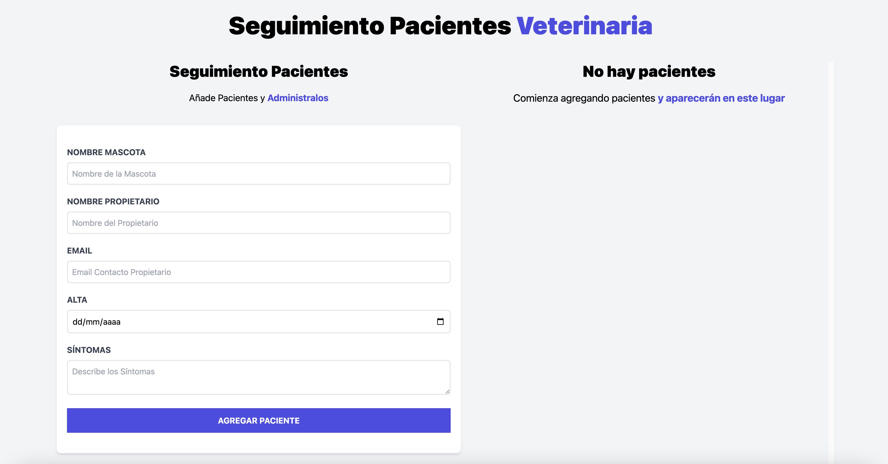
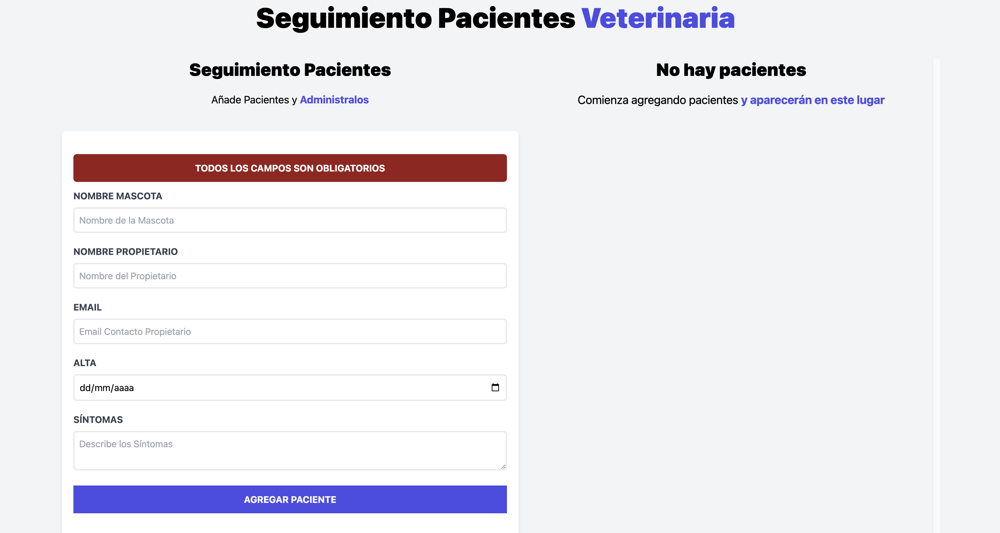
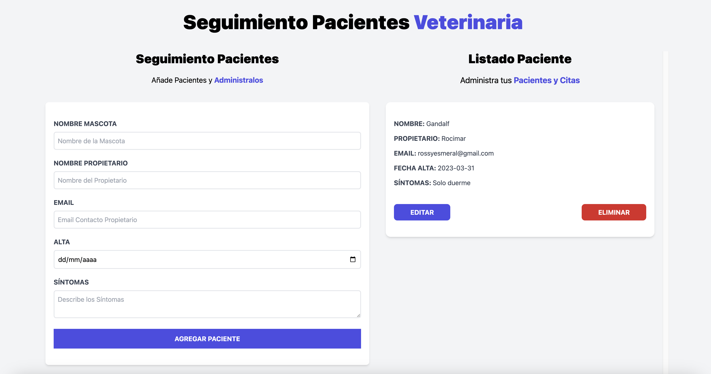
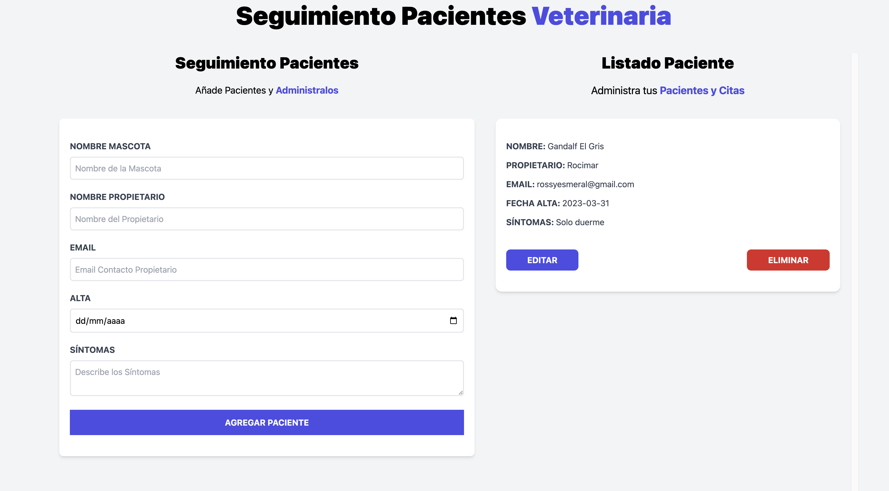
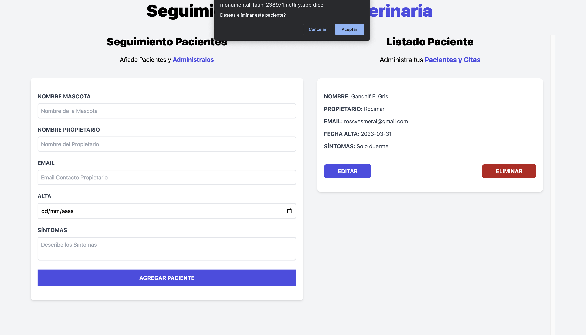

# App Seguimiento a Pacientes Veterinarios

## Índice

* [1. Proyecto](#1-proyecto)
* [2. Imagenes](#2-imagenes-de-la-App)

***
## 1. Proyecto
Esta aplicación web fue creada para Registrar a pacientes en una Veterinaria, en esta aplicación se podrán guardar
los datos de la mascota, nombre del propietario, email del propietario, fecha del alta de la mascota y los síntomas 
por el cual fue ingresado. Para ver la App dar click en el enlace:
[citas-react] https://monumental-faun-238971.netlify.app/

## 2. Imagenes de la App

